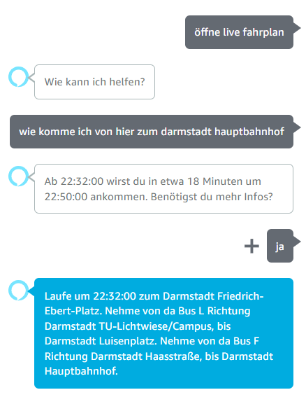

# 🚀Motivation🚀
This project was developed with the goal to learn about API-Requests and Alexa skill development

# 🤖Simplified Explanation of how it works
1. Alexa gets an intent from the User to launch the skill
2. Alexa identifies the desired destination and calls "JourneyDuration.get_alexa_formatted_travel_time()"
3. JourneyDuration sends a request to rmv-api, at first the response is processed only process for the duration of the Journey
4. Alexa asks if the user wishes for more information
5. If so "TravelDetails.more_details_for_trip()" is called to further process the response and provide a detailed trip plan. Otherwise, the session ends.

# 📝Result examples

# ⚠️Limitations of this Repository
Most of the Alexa-related components are handled on the Alexa skill development platform and not uploaded in this Repository.
Furthermore I only intend to use this from my alexa device at home, therefore the starting location is fixed.

